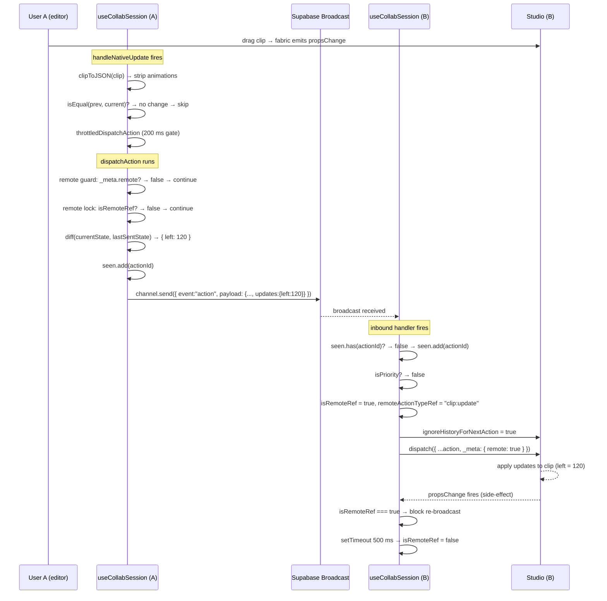

## Overview

OpenVideo supports **real-time collaborative editing**, allowing multiple users to edit the same project simultaneously. Every change—whether made through the action dispatcher or directly on a canvas object—is synchronized instantly across all connected clients through a dual-path, differential broadcast architecture.

## How It Works

The collaborative system intercepts edits at two levels and broadcasts them over a Supabase Realtime channel:

1. **Action path** — listens to `action:dispatched` and forwards any `StudioAction` that was not itself sourced from a remote broadcast.
2. **Native path** — attaches per-clip listeners (`propsChange`, `moving`, `rotating`, `scaling`) and studio-level events (`clip:added`, `clips:added`, `clip:removed`, `clips:removed`, `clip:moved`) to catch mutations that bypass the action system entirely.

Both paths funnel into a single `dispatchAction` function that handles deduplication, diffing, and the actual Supabase `channel.send` call.

### Architecture

| Concern | Mechanism |
|---|---|
| Transport | Supabase Realtime **Broadcast** channel (`room:<projectId>`) |
| Self-echo prevention | `{ self: false }` channel config |
| Deduplication | `seen` Set keyed by `actionId` UUID |
| Update bandwidth | Differential diffing — only changed keys are sent |
| Echo loop prevention | `isRemoteRef` lock blocks re-broadcasting incoming actions |
| History isolation | `studio.ignoreHistoryForNextAction = true` before every remote dispatch |
| Undo/redo safety | Remote actions are flagged `_meta.remote = true` and bypass the local history stack |

---

## End-to-End Lifecycle

The diagram below shows the complete journey of a single edit from the moment a user drags a clip to the moment the other user's canvas reflects the change.



### Key Observations

- **User A never knows about User B's stack.** The channel is fire-and-forget; there is no acknowledgment message from B back to A.
- **The `seen` set is the only cross-path dedup guard.** Its entries persist for the lifetime of the hook mount, so replayed or late-arriving duplicates are always silently dropped.
- **B's undo history is untouched.** `ignoreHistoryForNextAction` ensures the received action is invisible to B's undo/redo stack.
- **The 500 ms lock** on the receiving side in step 8 absorbs any reactive `propsChange` events the studio emits as a result of the applied update, preventing them from being mistakenly re-broadcast as new local edits.

## Enabling Collaboration

### In the Editor

```tsx
import { useCollabSession } from "@/hooks/use-collab-session";

function Editor({ studio, projectId, userId }) {
  useCollabSession(studio, {
    projectId,   // Unique room identifier
    userId,      // Current user identifier (added to every action's _meta)
    enabled: true,
  });

  // Your editor UI here
}
```

### Requirements

- **Supabase Setup**: A Supabase project with Realtime Broadcast enabled.
- **Project ID**: Uniquely identifies the collaborative room (`room:<projectId>`).
- **User ID**: Added to every outgoing action's `_meta` for attribution.

---

## Sending Changes — Outbound Path

### Action Interception (`action:dispatched`)

Every call to `studio.dispatch(action)` fires `action:dispatched`. The hook handles it with:

```ts
const handleAction = ({ action }) => dispatchAction(action);
studio.on("action:dispatched", handleAction);
```

`dispatchAction` applies the following gates before transmitting:

1. **Remote guard** — if `action._meta?.remote` is `true` the action was sourced from an incoming broadcast. It is silently dropped to prevent echo loops.
2. **Remote lock** — if another user's action is currently being applied (`isRemoteRef.current === true`) and the current action is **not** a priority action, it is blocked. This prevents local reactive side-effects from being mistakenly re-broadcast during a remote update.

### Native Mutation Interception

Direct property mutations on fabric/canvas objects do not go through `studio.dispatch`. The hook attaches listeners to catch them:

```
Per-clip events:  propsChange | moving | rotating | scaling
Studio events:    clip:added  | clips:added
                  clip:removed | clips:removed
                  clip:updated | clip:moved | clip:propsChange | propsChange
```

When any of these fires, `handleNativeUpdate` serializes the full clip state with `clipToJSON(clip)`, strips the `animations` key (managed separately via discrete actions), and forwards it to `throttledDispatchAction`.

> **Why strip `animations`?** Animation objects carry native prototype methods (e.g., `.getTransform()`). Sending them as plain JSON and re-applying via `Object.assign` on the remote side destroys those bindings, breaking the animation engine. Add/remove operations are therefore handled exclusively by the `clip:add-animation` / `clip:remove-animation` actions.

### Throttling for Native Updates

Native updates are throttled at **200 ms** (`leading: true, trailing: true`) to avoid flooding the channel during continuous interactions like dragging or resizing. Explicit action dispatches are sent immediately (unthrottled).

```ts
const throttledDispatchAction = throttle(dispatchAction, 200, {
  leading: true,
  trailing: true,
});
```

### Differential Diffing for `clip:update`

For `clip:update` actions, `dispatchAction` computes a **diff** between the current clip state and the last successfully transmitted baseline:

```
1. Serialize full clip state → currentState
2. Load previous baseline  → lastSentState.get(clipId)
3. Compute diff: { key: value } for every key where currentState[key] !== lastSentState[key]
4. If diff is empty → drop (no-op, nothing changed)
5. Mutate action.payload.updates = diff
6. Update baseline: lastSentState.set(clipId, currentState) ← always the FULL state
7. Transmit
```

This means the **wire payload only contains changed properties**, dramatically reducing bandwidth for large clips with many properties (e.g., captions with many fields).

> **Note:** The baseline is always stored as the full state. This means trailing throttle calls always carry a complete snapshot for the diff, preventing stale-baseline drift across rapid sequential edits.

### Wire Format

Every outgoing broadcast is a Supabase Broadcast envelope with this outer shape:

```json
{
  "type": "broadcast",
  "event": "action",
  "payload": { ... }
}
```

The inner `payload` is a `StudioAction` extended with `_meta`. The `actionId` is generated at send time with `crypto.randomUUID()` and immediately added to the local `seen` set so that if the server reflects the message back it will be silently ignored.

---

## Wire Payload Examples

The following examples show the exact JSON that travels over the Supabase channel for each action category. The outer `{ type, event }` envelope is omitted for clarity — only the `payload` field is shown.

### Clip Update (diffed)

Only properties that changed since the last sent baseline are included in `updates`. A drag that moved the clip 20 px to the right produces:

```json
{
  "type": "clip:update",
  "payload": {
    "clipId": "c1f2a3b4-...",
    "updates": {
      "left": 120
    }
  },
  "_meta": {
    "actionId": "a0b1c2d3-...",
    "userId": "user-alice",
    "timestamp": 1713401234567
  }
}
```

A resize that changed both width and position sends both changed keys:

```json
{
  "type": "clip:update",
  "payload": {
    "clipId": "c1f2a3b4-...",
    "updates": {
      "left": 80,
      "width": 560,
      "scaleX": 1.4
    }
  },
  "_meta": { "actionId": "...", "userId": "user-alice", "timestamp": 1713401234999 }
}
```

> `animations` is **never present** in a `clip:update` payload. Animation state is managed exclusively through `clip:add-animation` and `clip:remove-animation`.

### Clip Add (single)

The full serialized clip state is sent. The `animations` key is stripped before transmission:

```json
{
  "type": "clip:add",
  "payload": {
    "trackId": "track-01",
    "clip": {
      "id": "c9d8e7f6-...",
      "type": "image",
      "src": "https://cdn.example.com/photo.jpg",
      "left": 0,
      "top": 0,
      "width": 1280,
      "height": 720,
      "opacity": 1,
      "startTime": 0,
      "duration": 5000
    }
  },
  "_meta": { "actionId": "...", "userId": "user-alice", "timestamp": 1713401300000 }
}
```

### Clip Add (batch — e.g. caption generation)

Batch adds (`clips:added`) are exploded into individual `clip:add` messages, one per clip. The receiver reconstructs them independently:

```json
// Message 1 of N
{
  "type": "clip:add",
  "payload": { "trackId": "track-captions", "clip": { "id": "cap-01", ... } },
  "_meta": { "actionId": "uuid-1", "userId": "user-alice", "timestamp": 1713401400001 }
}

// Message 2 of N
{
  "type": "clip:add",
  "payload": { "trackId": "track-captions", "clip": { "id": "cap-02", ... } },
  "_meta": { "actionId": "uuid-2", "userId": "user-alice", "timestamp": 1713401400002 }
}
```

### Clip Remove (single and batch)

Only the `clipId` is needed — no state is sent:

```json
{
  "type": "clip:remove",
  "payload": {
    "clipId": "c1f2a3b4-..."
  },
  "_meta": { "actionId": "...", "userId": "user-bob", "timestamp": 1713401500000 }
}
```

Batch removes are also exploded into individual `clip:remove` messages, one per `clipId`.

### Animation Add / Remove (priority)

Animation actions carry the full animation descriptor. These are dispatched directly through `studio.dispatch()` and forwarded as-is by the action path:

```json
// Add
{
  "type": "clip:add-animation",
  "payload": {
    "clipId": "c1f2a3b4-...",
    "animation": {
      "id": "anim-01",
      "type": "fadeIn",
      "duration": 500,
      "easing": "easeOutCubic"
    }
  },
  "_meta": { "actionId": "...", "userId": "user-alice", "timestamp": 1713401600000 }
}

// Remove
{
  "type": "clip:remove-animation",
  "payload": {
    "clipId": "c1f2a3b4-...",
    "animationId": "anim-01"
  },
  "_meta": { "actionId": "...", "userId": "user-alice", "timestamp": 1713401700000 }
}
```

### Track Actions

```json
// Add
{ "type": "track:add", "payload": { "track": { "id": "track-02", "type": "video" } }, "_meta": { ... } }

// Remove (priority)
{ "type": "track:remove", "payload": { "trackId": "track-02" }, "_meta": { ... } }

// Reorder
{ "type": "track:reorder", "payload": { "trackId": "track-02", "newIndex": 0 }, "_meta": { ... } }
```

### Settings Actions

```json
// Background color
{ "type": "settings:bg-color", "payload": { "color": "#1a1a2e" }, "_meta": { ... } }

// Canvas size
{ "type": "settings:size", "payload": { "width": 1920, "height": 1080 }, "_meta": { ... } }
```

---

## Receiving Changes — Inbound Path

### Channel Listener

The hook listens for `broadcast` events on the `action` channel event:

```ts
channel.on("broadcast", { event: "action" }, async ({ payload }) => {
  const action = payload as StudioAction;
  // ...
});
```

### Inbound Processing Pipeline

```
1. Deduplication check
   └─ If action._meta.actionId is in seen → drop (already processed)
   └─ Otherwise add actionId to seen

2. Classify action
   └─ isPriority = type is one of:
        clip:remove | track:remove | clip:remove-animation | clip:add-animation

3. Set remote lock
   └─ isRemoteRef.current = true
   └─ remoteActionTypeRef.current = action.type

4. Apply to local studio
   └─ studio.ignoreHistoryForNextAction = true   ← skips undo stack
   └─ await studio.dispatch({ ...action, _meta: { ...action._meta, remote: true } })

5. Release remote lock
   └─ Priority action  → release immediately (synchronous)
   └─ Non-priority     → release after 500 ms timeout
```

### What the Receiver Sees — Step by Step

Here is a concrete walkthrough of what happens when User B receives a `clip:update` sent by User A:

**1. Raw broadcast arrives**

Supabase delivers the message to B's channel listener. The full envelope looks like:

```json
{
  "event": "action",
  "payload": {
    "type": "clip:update",
    "payload": { "clipId": "c1f2a3b4", "updates": { "left": 120 } },
    "_meta": { "actionId": "a0b1c2d3", "userId": "user-alice", "timestamp": 1713401234567 }
  }
}
```

**2. Deduplication**

The handler immediately checks `seen.current.has("a0b1c2d3")`. If the ID is unknown (normal case), it is added to `seen` and processing continues.

**3. Remote lock engaged**

`isRemoteRef.current` is set to `true` and `remoteActionTypeRef.current` is set to `"clip:update"`. Any native events the studio emits as a side-effect of this action will be caught by the native listeners, but they will be dropped by the `if (isRemoteRef.current) return` guard inside `handleNativeUpdate`.

**4. History skipped**

`studio.ignoreHistoryForNextAction = true` is set immediately before the dispatch. This flag tells the studio engine to process the action normally—updating the canvas—but not to push it onto the undo stack. B's undo history remains as if the remote change never happened.

**5. Action applied**

```ts
await studio.dispatch({
  type: "clip:update",
  payload: { clipId: "c1f2a3b4", updates: { left: 120 } },
  _meta: { actionId: "a0b1c2d3", userId: "user-alice", timestamp: 1713401234567, remote: true },
});
```

The studio finds clip `c1f2a3b4` and calls `Object.assign(clip, { left: 120 })`. The canvas re-renders and B immediately sees the clip move.

**6. Lock released after 500 ms**

Because `clip:update` is a non-priority action, a `setTimeout` of 500 ms is started. During this window, reactive `propsChange` or `moving` events fired by the studio as a result of the canvas re-render are silently absorbed — they hit `handleNativeUpdate`, detect `isRemoteRef.current === true`, and return early. After 500 ms, the lock clears and B's local edit events resume being broadcast normally.

**For priority actions (`clip:remove`, `clip:add-animation`, etc.)**, the lock is released immediately and synchronously in the `finally` block. These actions are atomic — the studio does not emit cascading native events after them.

### Why the 500 ms Delay for Non-Priority Actions?

When a remote `clip:update` is applied, the studio engine may emit reactive events (e.g., `propsChange`) as a side-effect of the canvas re-render. Without a delayed lock release, those secondary events would be caught by the native listeners and re-broadcast back to User A — creating an echo loop where A's edit bounces back as a new action from B.

The 500 ms window absorbs this reactive cascade before the lock is released. Priority actions (removals, animation mutations) are synchronous and deterministic — they do not produce cascading native events — so they release immediately.

### History Isolation

```ts
studio.ignoreHistoryForNextAction = true;
```

This flag is set before every remote dispatch to prevent the remote action from entering the local undo/redo history. Each user maintains their own independent history stack. This prevents the situation where undoing an action would un-apply another user's work.

---

## Priority Actions

Priority actions bypass the remote lock on the **outbound** side, and release the lock immediately on the **inbound** side:

| Action | Priority | Reason |
|---|---|---|
| `clip:remove` | ✅ | Deletions must always propagate regardless of concurrent updates |
| `track:remove` | ✅ | Same as above |
| `clip:add-animation` | ✅ | Discrete modifier — must not be swallowed by a concurrent update lock |
| `clip:remove-animation` | ✅ | Same as above |

All other actions (`clip:update`, `clip:add`, `track:add`, etc.) are **non-priority** and respect the remote lock.

---

## Per-Clip Native Listener Lifecycle

When a new clip is added (`clip:added` / `clips:added`), the hook calls `setupClipListeners(clip)`:

```ts
const events = ["propsChange", "moving", "rotating", "scaling"];
events.forEach((ev) => clip.on(ev, onUpdate));
```

These listeners are tracked in a `clipListeners` Map. At cleanup time, every listener is removed:

```ts
clipListeners.forEach((cleanup) => cleanup());
clipListeners.clear();
```

Clips that already exist when the hook mounts also have listeners attached by iterating `studio.clips` during initialization.

---

## Action Types

The following `StudioAction` types are broadcast and synchronized:

### Clip Actions

| Action | Origin | Notes |
|---|---|---|
| `clip:add` | Native (`clip:added`) | Serialized via `clipToJSON`; `animations` key stripped |
| `clip:add` (batch) | Native (`clips:added`) | Each clip dispatched individually |
| `clip:remove` | Native (`clip:removed`) + Action path | Priority; always transmitted |
| `clip:remove` (batch) | Native (`clips:removed`) | Each clipId dispatched individually |
| `clip:update` | Native (props/move/scale/rotate) + Action path | Diffed before transmission |
| `clip:split` | Action path | Full payload |
| `clip:replace` | Action path | Full payload |
| `clip:lock` | Action path | Full payload |
| `clip:add-animation` | Action path | Priority; discrete action |
| `clip:remove-animation` | Action path | Priority; discrete action |

### Track Actions

| Action | Notes |
|---|---|
| `track:add` | Full payload |
| `track:remove` | Priority; always transmitted |
| `track:move` | Full payload |
| `track:reorder` | Full payload |

### Effects & Transitions

| Action | Notes |
|---|---|
| `transition:add` | Full payload |
| `effect:add-global` | Full payload |
| `effect:remove` | Full payload |

### Playback & Settings

| Action | Notes |
|---|---|
| `playback:play` / `playback:pause` / `playback:seek` | Full payload |
| `settings:bg-color` | Full payload |
| `settings:size` | Full payload |

---

## Deduplication

Every action that passes through `dispatchAction` is assigned a UUID:

```ts
const actionId = crypto.randomUUID();
seen.current.add(actionId);
```

On the receiving side, the first thing the inbound handler does is check `seen`:

```ts
if (id && seen.current.has(id)) return;
if (id) seen.current.add(id);
```

This ensures an action is applied **exactly once**, even if the Supabase channel reflects the sender's own messages (though `{ self: false }` already prevents this in normal operation).

---

## State Tracking Maps

The hook maintains two internal `Map<clipId, state>` structures:

| Map | Purpose |
|---|---|
| `lastSentState` | Baseline for diff computation. Updated every time an action is successfully transmitted. |
| `activeState` | Tracks the latest known state of each clip. Used by `handleNativeUpdate` to avoid dispatching no-op updates when the clip state hasn't actually changed. |

Both maps are populated when a clip is first added and updated on every successful send.

---

## Best Practices

### For Developers

- **Mark Remote Actions**: Always check `action._meta?.remote === true` before performing side effects that should only run for local actions.
- **Prefer `studio.dispatch()`**: Actions dispatched through the studio are observable and will be automatically picked up by the `action:dispatched` listener.
- **Animations via Discrete Actions**: Never mutate animation arrays directly. Use `clip:add-animation` / `clip:remove-animation` actions so the collaborative system can synchronize them correctly without corrupting prototype chains on the remote side.
- **Provide Action Metadata**: If you construct actions manually, include `_meta.actionId` (a UUID) to enable deduplication. If omitted, the hook will generate one automatically.

### For Users

- **Stable Connection**: Realtime sync depends on a persistent WebSocket connection. Unstable networks will cause missed updates.
- **Save Regularly**: The collaborative session synchronizes live edits but does not replace explicit saves. Save your project periodically to persist the state.
- **Coordinate Complex Operations**: Large-scale restructuring (e.g., reordering many tracks) is best communicated via external chat to avoid conflicting concurrent edits.
