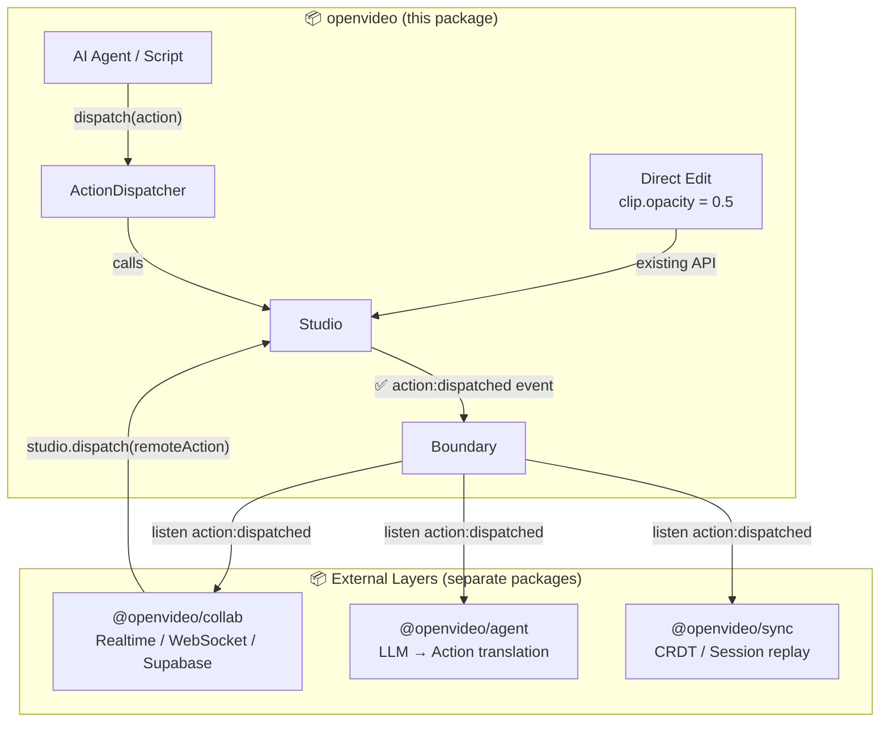

# Action-Based Editing Primitives for OpenVideo SDK

> **Architecture Decision (finalized):**
> `openvideo` ships **only the primitive action layer** — action types and a dispatcher.
> Realtime, collaborative, and agentic transport layers are **separate packages/integrations** built on top.
> `openvideo` never imports a WebSocket, Supabase, or any realtime library.

## Overview

Two separate, independent layers:

### Layer 1 — `openvideo` (this package)
Adds a **serializable action system** to the Studio:
- `StudioAction` union type: every possible edit described as plain JSON
- `ActionDispatcher`: maps actions → Studio methods
- `Studio.dispatch()`: convenience wrapper
- `action:dispatched` event: lets external layers observe every action

This is the **only** thing `openvideo` ships. No network code. No realtime. No session management.

### Layer 2 — External packages (not in this repo)
Built **on top** of the `action:dispatched` event + `Studio.dispatch()`:

| Package (example) | Responsibility |
|---|---|
| `@openvideo/collab` | Realtime collaborative sessions (WebSocket / Supabase) |
| `@openvideo/agent` | AI/LLM agentic editing helpers, prompt→action translation |
| `@openvideo/sync` | Offline-first sync, CRDT, session replay |

These packages are NOT planned here — only the contract they depend on (`StudioAction` + `action:dispatched`) is designed in this plan.

**Key principle**: `openvideo` stays a pure editing engine. It never imports a transport library. Everything is additive — zero breaking changes.

---

## User Review Required

> [!IMPORTANT]
> **Scope boundary**: Nothing in this plan touches network, WebSocket, or realtime libraries. `openvideo` only gains the action types + dispatcher. Realtime is explicitly out of scope for this package.

> [!NOTE]
> The existing `HistoryManager` stores diff patches. This plan optionally extends it to also record the **action name + payload** alongside each patch — enabling session replay logs that external packages can consume.

> [!NOTE]
> **Direct mutation parity**: `clip.opacity = 0.5` does NOT automatically produce a `StudioAction`. It goes through the existing `propsChange → saveHistory` path unchanged. Only calls to `studio.dispatch()` produce `action:dispatched` events. This is intentional — it keeps `dispatch()` as the explicit "observable" path for agentic/collab layers.

---

## Architecture Overview



The **only contract** between `openvideo` and external layers:
- **Outbound**: `studio.on('action:dispatched', ({ action }) => ...)` — every dispatched action is observable
- **Inbound**: `studio.dispatch(action: StudioAction)` — any external system can apply actions

---

## Proposed Changes

### 1. Action Types

#### [NEW] `src/actions/index.ts`

Defines the full `StudioAction` union type. Every action is a **plain serializable object** — no class instances, no functions. This is the contract that external layers depend on.

**Core clip actions:**
```ts
{ type: 'clip:add',        payload: { clip: ClipJSON, trackId?: string } }
{ type: 'clip:remove',     payload: { clipId: string } }
{ type: 'clip:update',     payload: { clipId: string, updates: Partial<ClipUpdateFields> } }
{ type: 'clips:update',    payload: { updates: Array<{ id: string; updates: Partial<ClipUpdateFields> }> } }
{ type: 'clip:split',      payload: { clipId: string, time: number } }
{ type: 'clip:replace',    payload: { clipId: string, newClip: ClipJSON } }
{ type: 'clip:lock',       payload: { clipId: string, locked: boolean } }
{ type: 'clip:add-animation',    payload: { clipId: string, name: string, opts: any, params?: any } }
{ type: 'clip:remove-animation', payload: { clipId: string, animationId: string } }
```

**Track actions:**
```ts
{ type: 'track:add',     payload: { name: string; type: string; id?: string; index?: number } }
{ type: 'track:remove',  payload: { trackId: string } }
{ type: 'track:move',    payload: { trackId: string; index: number } }
{ type: 'track:reorder', payload: { trackIds: string[] } }
```

**Transition & effect actions:**
```ts
{ type: 'transition:add',    payload: { key: string; duration: number; fromClipId: string; toClipId: string } }
{ type: 'effect:add-global', payload: { key: string; startTime: number; duration: number; trackIndex?: number } }
{ type: 'effect:remove',     payload: { effectId: string } }
```

**Playback & settings:**
```ts
{ type: 'playback:play' }
{ type: 'playback:pause' }
{ type: 'playback:seek',     payload: { time: number } }
{ type: 'settings:bg-color', payload: { color: string } }
{ type: 'settings:size',     payload: { width: number; height: number } }
```

**History:**
```ts
{ type: 'history:undo' }
{ type: 'history:redo' }
```

**Open metadata slot** (external layers can stamp this, openvideo ignores it):
```ts
// Every action optionally carries a _meta field.
// openvideo does NOT read or write this — it passes it through transparently.
// External packages (collab, agent, sync) use it for dedup, attribution, etc.
_meta?: Record<string, unknown>;
```

---

### 2. ActionDispatcher

#### [NEW] `src/studio/action-dispatcher.ts`

Maps each action type to the appropriate Studio method. Returns a `Promise<void>`.

```ts
export class ActionDispatcher {
  constructor(private studio: Studio) {}

  async dispatch(action: StudioAction): Promise<void> {
    // 1. Skip if remote echo (collaborative dedup)
    if (action._meta?.remote && this.session?.hasSeen(action._meta.actionId)) return;

    // 2. Execute
    await this._execute(action);

    // 3. Emit so app and collaborative session can react
    this.studio.emit('action:dispatched', { action });

    // 4. Forward to collaborative session if attached
    if (this.session && !action._meta?.remote) {
      this.session.broadcast(action);
    }
  }

  private async _execute(action: StudioAction) {
    switch (action.type) {
      case 'clip:add':
        const clip = await jsonToClip(action.payload.clip);
        await this.studio.addClip(clip, { trackId: action.payload.trackId });
        break;
      case 'clip:remove':
        const c = this.studio.timeline.getClipById(action.payload.clipId);
        if (c) await this.studio.removeClip(c);
        break;
      case 'clip:update':
        await this.studio.updateClip(action.payload.clipId, action.payload.updates);
        break;
      // ... etc for all types
    }
  }

  private session: CollaborativeSession | null = null;
  attachSession(s: CollaborativeSession) { this.session = s; }
  detachSession() { this.session = null; }
}
```

---

### 3. Studio Integration

#### [MODIFY] `src/studio.ts`

Add 3 things:
1. `public dispatcher: ActionDispatcher` — instantiated in constructor
2. `public dispatch(action: StudioAction): Promise<void>` — sugar around dispatcher
3. New event type on `StudioEvents`: `'action:dispatched': { action: StudioAction }`

```ts
// In StudioEvents interface (additive):
'action:dispatched': { action: StudioAction };

// In Studio class:
public dispatcher: ActionDispatcher;

constructor(opts: IStudioOpts) {
  super();
  // ... existing init
  this.dispatcher = new ActionDispatcher(this);
}

public dispatch(action: StudioAction): Promise<void> {
  return this.dispatcher.dispatch(action);
}
```

This keeps the existing API 100% intact. Direct mutations (`clip.opacity = 0.5`) still work and still push to `HistoryManager` via the existing `propsChange` → `saveHistory` path.

---

### 4. ~~Collaborative Session~~ → External Layer

> [!IMPORTANT]
> This section describes what an **external package** (`@openvideo/collab`) would look like. Nothing here ships inside `openvideo`. It's documented here as a reference contract.

An external collab package consumes the `action:dispatched` event and calls `studio.dispatch()` for inbound actions:

```ts
// @openvideo/collab — external package, NOT part of openvideo
import type { StudioAction } from 'openvideo';

export class CollabSession {
  private seen = new Set<string>();

  constructor(
    private studio: Studio,
    private transport: CollabTransport, // WebSocket, Supabase, etc.
    private userId: string,
  ) {
    // 1. Observe all dispatched actions and broadcast to peers
    studio.on('action:dispatched', ({ action }) => {
      if (action._meta?.remote) return; // Don't echo back
      this.broadcast(action);
    });

    // 2. Receive peer actions and apply to local studio
    transport.onReceive((action) => {
      const id = action._meta?.actionId as string | undefined;
      if (id && this.seen.has(id)) return;
      if (id) this.seen.add(id);
      // Apply to local studio (flagged as remote to avoid re-broadcast)
      studio.dispatch({ ...action, _meta: { ...action._meta, remote: true } });
    });
  }

  private broadcast(action: StudioAction) {
    const stamped = {
      ...action,
      _meta: { actionId: crypto.randomUUID(), userId: this.userId, timestamp: Date.now() },
    };
    this.seen.add(stamped._meta.actionId);
    this.transport.send(stamped);
  }
}
```

The external package **only** needs two things from `openvideo`:
- `StudioAction` type (exported)
- `studio.on('action:dispatched', ...)` + `studio.dispatch()` (added in this plan)

No changes to `openvideo` internals are needed beyond what Layer 1 already provides.

---

### 5. HistoryManager Extension

#### [MODIFY] `src/studio/history-manager.ts`

Optionally attach an action label to each history entry (non-breaking):

```ts
export interface HistoryEntry {
  patches: Difference[];
  action?: StudioAction; // NEW: optional action that caused this diff
}
```

This enables an **edit session log** — export a sequence of `{ action, timestamp }` objects for replay, audit, or AI fine-tuning datasets.

---

### 6. Exports

#### [MODIFY] `src/index.ts`

Only export the core action primitives — no transport adapters:

```ts
// Action system primitives (the full external contract)
export type { StudioAction, ClipActionPayload, TrackActionPayload } from './actions';
export { ActionDispatcher } from './studio/action-dispatcher';

// Nothing else — no transports, no collab, no sessions
```

---

## Example Actions

### Agentic Editing Example

An AI produces structured edits — no SDK imports needed on the agent side:

```ts
// --- AI agent output (plain JSON) ---
const agentActions: StudioAction[] = [
  {
    type: 'clip:add',
    payload: {
      clip: {
        type: 'Video',
        src: 'https://cdn.example.com/intro.mp4',
        display: { from: 0, to: 5000000 },
        left: 0, top: 0, width: 1920, height: 1080,
        // ... other base fields
      }
    }
  },
  {
    type: 'clip:update',
    payload: {
      clipId: 'clip_abc123',
      updates: { opacity: 0.8, left: 200 }
    }
  },
  {
    type: 'transition:add',
    payload: {
      key: 'fade',
      duration: 1000000,
      fromClipId: 'clip_abc123',
      toClipId: 'clip_def456'
    }
  },
  {
    type: 'clip:add-animation',
    payload: {
      clipId: 'clip_abc123',
      name: 'fadeIn',
      opts: { duration: 500000, delay: 0 }
    }
  },
  {
    type: 'settings:bg-color',
    payload: { color: '#1a1a2e' }
  }
];

// --- Application side ---
for (const action of agentActions) {
  await studio.dispatch(action);
}
```

### Direct Property Mutation (unchanged)

```ts
// This still works exactly as before — no changes needed
const clip = studio.clips[0];
clip.display.from = 0;
clip.opacity = 0.8;
clip.left = 200;
```

### Collaborative Session Setup (external layer — `@openvideo/collab`)

```ts
// This lives in @openvideo/collab, NOT in openvideo itself
import { CollabSession } from '@openvideo/collab';
import { Studio } from 'openvideo';

const studio = new Studio({ width: 1920, height: 1080 });
await studio.ready;

// The collab layer wires itself to the action:dispatched event
const session = new CollabSession(
  studio,
  new WebSocketTransport('wss://collab.example.com/room/my-project'),
  'user-alice'
);

// From here: every studio.dispatch() call is broadcast to peers automatically
// Direct mutations (clip.top = 50) are NOT broadcast — only dispatch() actions are
await studio.dispatch({ type: 'clip:update', payload: { clipId: 'x', updates: { left: 100 } } });

// Cleanup
session.destroy();
```

### Listening to All Actions (Audit / AI Logging)

```ts
studio.on('action:dispatched', ({ action }) => {
  console.log('[edit]', action.type, action.payload, action._meta?.userId);
  // Save to database for session replay or AI training data
});
```

### Undo / Redo via Action

```ts
// Works the same as studio.undo() / studio.redo() but is dispatchable from an agent
await studio.dispatch({ type: 'history:undo' });
await studio.dispatch({ type: 'history:redo' });
```

---

## File Summary

| File | Status | Purpose |
|---|---|---|
| `src/actions/index.ts` | **NEW** | Full `StudioAction` union type |
| `src/studio/action-dispatcher.ts` | **NEW** | Maps actions → Studio methods |
| `src/studio/collaborative-session.ts` | **NEW** | Pluggable collab session |
| `src/studio/transports/websocket-transport.ts` | **NEW** | Reference WebSocket adapter |
| `src/studio/transports/supabase-transport.ts` | **NEW** | Reference Supabase adapter |
| `src/studio.ts` | **MODIFY** | Add `dispatcher`, `dispatch()`, new event |
| `src/studio/history-manager.ts` | **MODIFY** | Optional action label per entry |
| `src/index.ts` | **MODIFY** | Export new public surface |

---

## Open Questions

> [!IMPORTANT]
> **Q1: Collaboration conflict resolution** — The initial plan uses **last-write-wins** (no OT/CRDT). This is sufficient for most agentic use cases. Add OT/CRDT only if you need fine-grained concurrent text editing.

> [!IMPORTANT]
> **Q2: Action vs. property mutation parity** — Should `clip.property = value` also broadcast to collaborators? If yes, we can intercept `propsChange` events and emit a synthetic `clip:update` action. This needs a decision before implementation.

> [!NOTE]
> **Q3: Action log persistence** — Should `session.exportLog()` return the full action log (for AI replay)? This is a small addition to `CollaborativeSession`.

> [!NOTE]
> **Q4: Which transports to ship?** — WebSocket transport is always useful. Supabase is project-specific. Should both be included in the package, or documented as external adapters?

---

## Verification Plan

### Automated Tests
- Unit test `ActionDispatcher`: each action type maps to the correct Studio method
- Unit test `CollaborativeSession`: broadcast/dedup/receive roundtrip with mock transport
- Extend existing `studio.spec.ts` with dispatch integration tests

### Manual Verification
- Agentic example: write a script that applies 5 different action types and verify results
- Collaborative example: open two browser tabs connected to a local WebSocket echo server; dispatch on tab A and verify it appears on tab B
